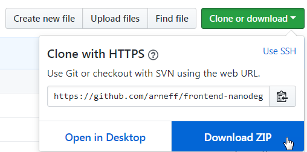
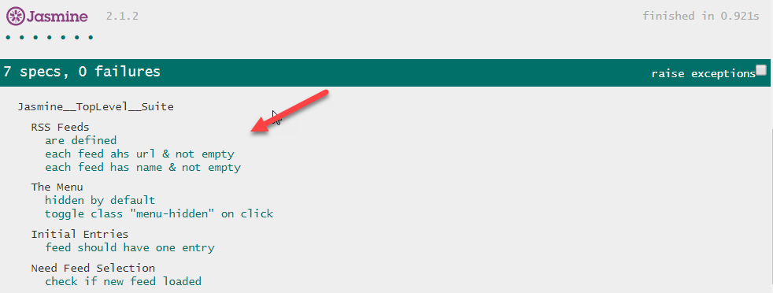

## How to Run the Game
1. Using Git
    1. git clone https://github.com/arneff/frontend-nanodegree-feedreader.git
    2. Open index.html
2. From Github
    1. Navigate to +https://github.com/arneff/frontend-nanodegree-feedreader  
    2. Download Zip
    3. Open index.html

  

3. Scroll to the bottom of the browser
4. Select the Test or Test Suite you wish to run

